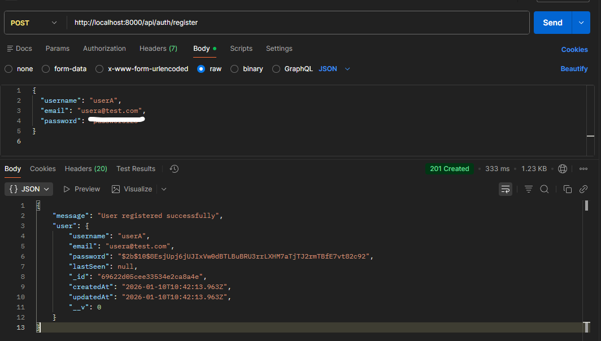
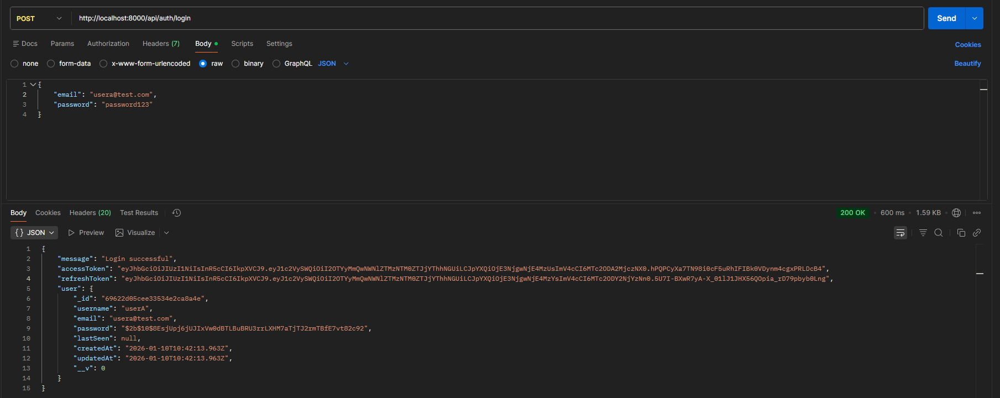
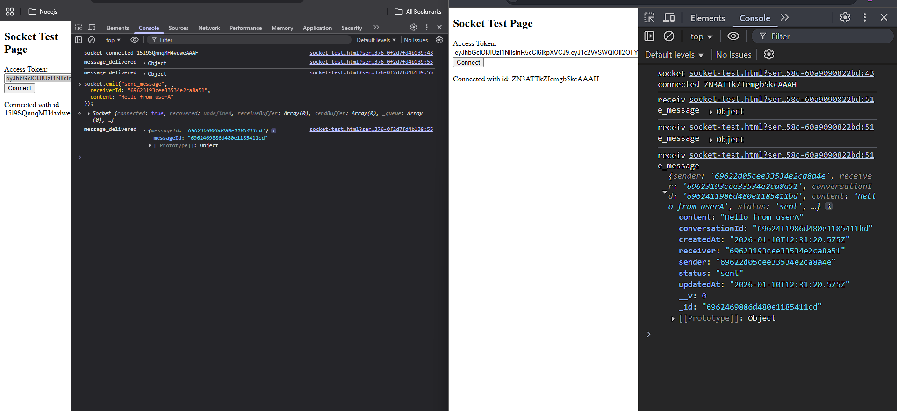
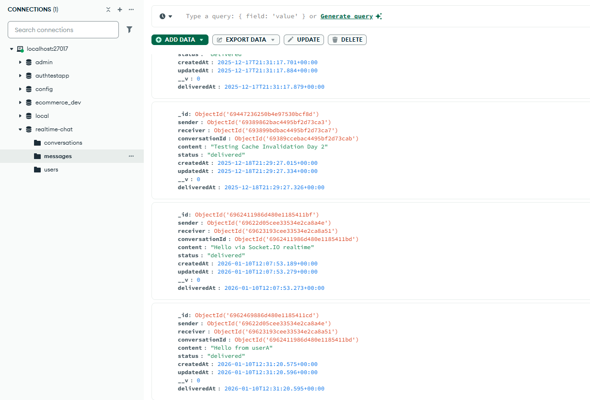
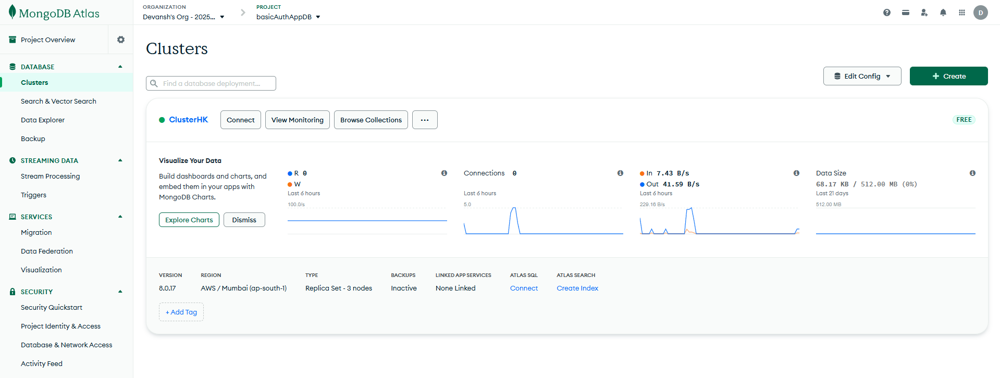
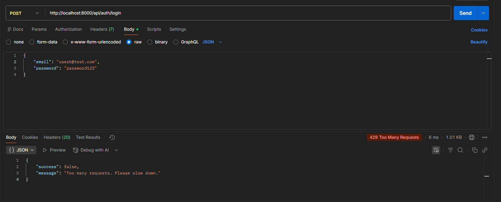
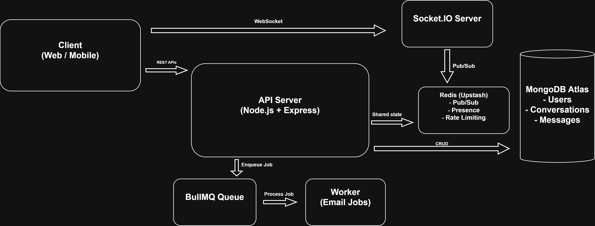
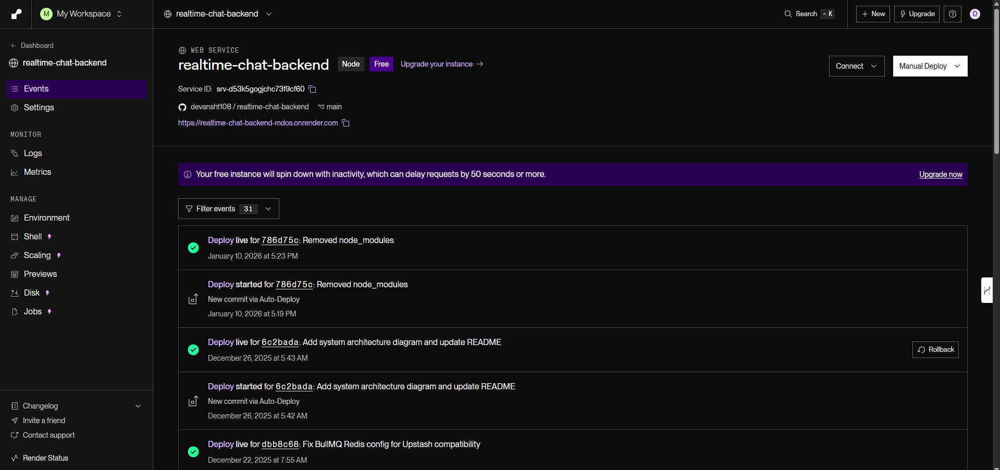

# Realtime Chat Backend

A production-grade, scalable real-time chat backend built with Node.js, TypeScript, Express, Socket.IO, MongoDB, Redis, and BullMQ.  
Designed to handle high concurrency, horizontal scaling, and real-world backend workloads.

## 🎥 Demo Video

5-minute Loom walkthrough explaining the system architecture, real-time messaging flow, Redis usage, and production deployment:  
https://www.loom.com/share/3132024899214395942281b83a229bee


---

## Project Overview

This project is a backend-only real-time chat system inspired by WhatsApp-style one-to-one messaging.

It focuses on building a clean, scalable, and production-ready backend architecture rather than a simple demo application.

Key goals of the project:

- Real-time messaging with delivery lifecycle
- Horizontal scalability using Redis Pub/Sub
- Background job processing using queues
- Secure authentication and rate limiting
- Cloud deployment readiness

The backend exposes REST APIs for core operations and uses Socket.IO for real-time communication.

---

## Project in Action

The following screenshots demonstrate the backend working end-to-end in a production environment.







---

## Tech Stack

### Core

- Node.js
- TypeScript
- Express.js

### Database

- MongoDB (Mongoose ODM)

### Real-Time Communication

- Socket.IO
- Redis (Pub/Sub, Presence, Scaling)

### Background Processing

- BullMQ (Redis-backed job queues)
- Worker processes for async tasks (emails)

### Authentication & Security

- JWT Authentication (Access Tokens & Refresh Tokens)
- bcrypt for password hashing
- Custom Redis-based rate limiter
- Helmet for security headers
- CORS configuration
- Morgan for request logging

### DevOps & Deployment

- Docker & Docker Compose
- MongoDB Atlas
- Upstash Redis
- Render (Production hosting)

---

## Features

### Authentication

- User registration and login
- JWT-based route protection
- Secure password hashing

### Messaging

- One-to-one conversations
- Automatic conversation creation
- Message lifecycle tracking:
  - sent
  - delivered
  - read
- Timestamp tracking for message events

### Real-Time (Socket.IO)

- Secure socket authentication using JWT
- Real-time message delivery
- Typing indicators
- Read receipts
- Multiple device support per user

### Presence System (Redis)

- Online / offline user tracking
- Last seen timestamps
- Redis-backed presence storage
- Efficient batch status fetching

### Rate Limiting

- Custom Redis-based rate limiter
- Per-IP limits
- Separate limits for authentication routes
- Fail-open strategy if Redis is unavailable

### Background Jobs

- BullMQ queues for async tasks
- Email jobs processed outside the main API
- Automatic retries with backoff

---

## API Testing & Data Persistence

The screenshots below verify that API requests result in correct database writes and enforcement of system constraints.







---

## Folder Structure

```plaintext
REALTIME-CHAT-BACKEND/
├── dist/
├── node_modules/
├── src/
│   ├── config/
│   ├── controllers/
│   ├── middleware/
│   ├── models/
│   ├── queues/
│   ├── routes/
│   ├── services/
│   ├── sockets/
│   ├── utils/
│   ├── workers/
│   ├── app.ts
│   └── server.ts
├── types/
├── docs/
│   └── architecture/
│       └── architecture-diagram.png
├── .env
├── docker-compose.yml
├── Dockerfile
├── package.json
├── tsconfig.json
└── README.md
```

---

## System Architecture

The following diagram illustrates the high-level architecture of the real-time chat backend, including REST APIs, Socket.IO-based real-time communication, Redis-based scaling, and background job processing.



### Architecture Explanation

- Clients communicate with the backend using REST APIs and Socket.IO.
- Express handles authentication, users, conversations, and message persistence.
- Socket.IO enables real-time messaging, typing indicators, and read receipts.
- Redis acts as a shared infrastructure layer for:
  - Socket.IO horizontal scaling (Pub/Sub)
  - Online/offline presence
  - Rate limiting
  - BullMQ job queues
- BullMQ workers process background tasks such as email notifications.
- MongoDB stores persistent data including users, conversations, and messages.

---

## Infrastructure & Deployment Proof



**Render Web Service (production environment)**  
The backend is deployed as a Render Web Service using production environment variables, with MongoDB Atlas and Upstash Redis.

## Environment Variables

```env
PORT=10000
MONGO_URI=mongodb+srv://<username>:<password>@cluster.mongodb.net/realtime-chat
ACCESS_TOKEN_SECRET=your_access_token_secret
REFRESH_TOKEN_SECRET=your_refresh_token_secret
REDIS_URL=your_upstash_redis_url
NODE_ENV=production
```

---

## Running Locally

### Without Docker

```
npm install
npm run dev
```

### With Docker

```
docker-compose up --build
```

---

## Deployment

The backend is deployed on Render using:

- MongoDB Atlas as the primary database
- Upstash Redis for Pub/Sub, rate limiting, and queues

  The server listens on process.env.PORT, which is automatically assigned by Render.

---

## Status

- Express API: ✅ Live
- MongoDB Atlas: ✅ Connected
- Redis: ✅ Connected
- BullMQ Workers: ✅ Running
- Socket.IO: ✅ Ready
